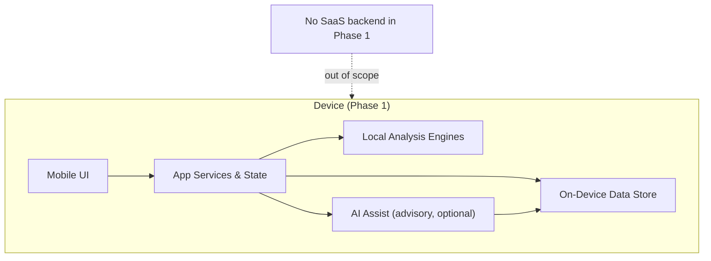

# Architecture Overview

Status: Draft — Phase 0 foundation

## Context

Blendex Labs Mobile is a new, independent mobile application for Blendex Labs analytical workflows. The defining constraint is **local-first**: the device is the primary home for both data and computation. There is no backend, no account system, and no network dependency in Phase 1.

This document describes the target shape of the Phase 1 application. It is intentionally high-level: platform, framework, and storage choices are deferred until implementation phases begin.

## Phase 1 target architecture

Single-user, single-device, offline-capable. All layers live on the device.

### Layers

| Layer | Phase 0 status | Responsibility |
| --- | --- | --- |
| Mobile UI | Not created | Screens for data entry, results, review; presentation only — contains no logic that affects results |
| App services & state | Not created | Local session, navigation, persistence access, export, permissions |
| Local analysis engines | Not created | Deterministic statistical/engineering computation; the only source of analytical results |
| On-device data store | Not created | Local persistence of structured data and files; never synchronized implicitly |
| AI assist | Not created | Optional advisory features operating behind the [AI boundary](ai-boundary.md) |

## Design constraints

1. **Local-first** — data residency, offline operation, and on-device compute. See [local-first.md](local-first.md) and [ADR-0001](../adr/0001-local-first-foundation.md).
2. **AI boundary** — AI is advisory, user-initiated, labeled, and auditable; the deterministic core never depends on AI. See [ai-boundary.md](ai-boundary.md) and [ADR-0002](../adr/0002-ai-advisory-boundary.md).
3. **No SaaS in Phase 1** — no backend, accounts, cloud sync, telemetry, or remote AI APIs. See [phase-1-scope.md](phase-1-scope.md).
4. **Independence** — no code imports from other Blendex repositories. Existing tool algorithms may inform engine design but are not copied wholesale in this phase.

## Planned repository layout

| Path | Planned content |
| --- | --- |
| `app/` | Mobile application (UI, services, state) |
| `engines/` | Local analysis engines, shared by the app |
| `docs/` | Architecture and project documentation (this tree) |

Directories for implementation phases are created only when implementation begins; Phase 0 is documentation-only.

## Deferred decisions

These are explicitly not decided in Phase 0:

- Mobile platform and framework (native, cross-platform, etc.)
- Engine implementation strategy (port, reimplementation, or shared-core library)
- On-device storage technology
- Import/export formats
- Whether and when any future cloud phase exists, and its consent model

Each deferred decision becomes an ADR when it is made.
